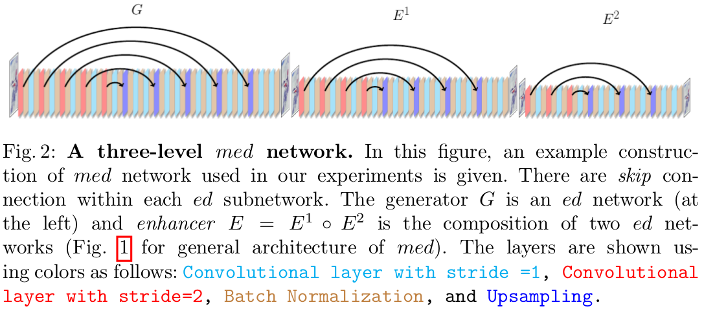

## Multilevel Encoder-Decoder Architectures for Image Restoration

Many real-world solutions for image restoration are learning-free and based on handcrafted image priors such as self-similarity. Recently, deep-learning methods that use training data have achieved state-of-the-art results in various image restoration tasks (e.g., super-resolution and inpainting). Ulyanov et al. bridge the gap between these two families of methods (CVPR 18). They have shown that learning-free methods perform close to the state-of-the-art learning-based methods (approximately 1 PSNR). Their approach benefits from the encoder-decoder network. In this paper, we propose a framework based on the multi-level extensions of the encoder-decoder network, to investigate interesting aspects of the relationship between image restoration and network construction independent of learning. Our framework allows various network structures by modifying the following network components: skip links, cascading of the network input into intermediate layers, a composition of the encoder-decoder subnetworks, and network depth. These handcrafted network structures illustrate how the construction of untrained networks influence the following image restoration tasks: denoising, super-resolution, and inpainting. We also demonstrate image reconstruction using flash and no-flash image pairs. We provide performance comparisons with the state-of-the-art methods for all the restoration tasks above.

### Super-resolution
Given a low-resolution (LR) image , and a scaling factor t, super-resolution aims to enhance image quality and generate a high-resolution (HR) image. The Tensorboard files for the results  will be provided soon.

### Denoising
Given a noisy image, denoising aims to reduce the noise and recover the clean image. The Tensorboard files for the results will be provided soon.

### Inpainting
Inpainting involves computing missing pixel values in the corrupted image in using the correspondence of a binary mask. The Tensorboard files for the results will be provided soon.

### Flash/no-Flash
Given flash/no-flash image pair, the objective is to obtain a high-quality image which incorporates details of the scene from the flash image and ambient illumination from the no-flash image. The Tensorboard files for the results will be provided soon.

